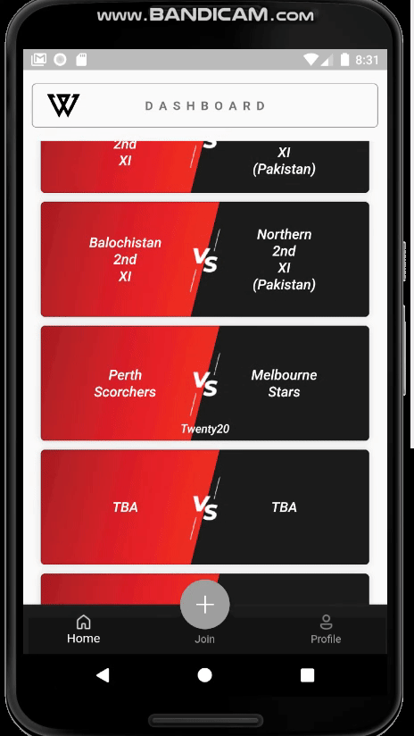
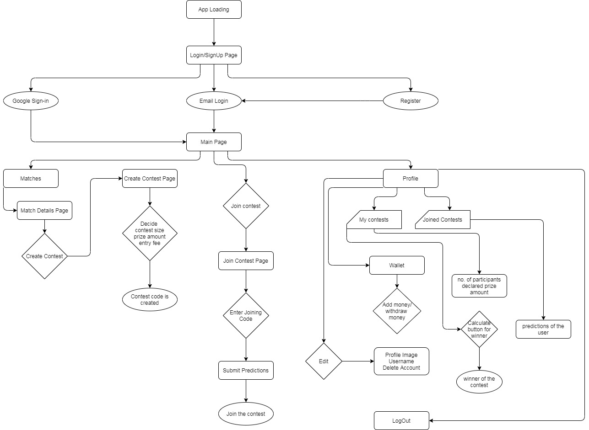

# Envision: Sports Private Pool

> The CricApi used in the app is down. The code was written way before, poorly architected and no longer maintained.

## Research Paper

[A Platform for Creating Private Pools or Contests for Fantasy Sports](https://www.irjet.net/archives/V8/i5/IRJET-V8I5239.pdf)

## Demo

 

## Features

- ✅ Create a contest (Prize money = Cost of creating a contest)
- ✅ Invite others to participate in the contest using Join-code
- ✅ Calculate result and announce the winner
- ✅ Distribute the prize money
- ✅ Add money to wallet

## Idea

Fantasy sports were already a big thing in foreign countries, but since India has entered the global market with Dream11 and FantasyIPL, the sector has grown exponentially. At the beginning, when fantasy sports applications entered the market, they targeted and rightly so, the most popular sport in the country, Cricket. The main idea in the app is to select the best possible XI between two teams who will perform the best. The XI who performs the best among the XIs put up by the participants wins. The final score is added up by summing up the points earned by the player during that fixture. These points are fixed already and there is a chance to earn multiple of these points by choosing marquee players for that match. This adds more twist to the already exciting game. But the problem is that the game is exciting for a knowledgeable audience only. For a country as big as India, that number is very high but there's room to bring more people to the application. As stated earlier, the whole country knows the game but it does not imply that everyone knows everything about each and every player in the game; they may be familiar with only stars of the game but enough so that they can select that player to perform well. This is the Tier-II audience, this research aims to target those who like the game enough to play it but are not obsessed with the statistics and previous results.

### Architecture:

Microservice architecture should divide this application
into three basic components:

1. API
2. Firebase
3. Client

API: The application is based on sports data like upcoming
fixtures, match score, players stats, etc. CricApi is a free
to use API which provides cricket scores, player statistics
and fantasy scorecard JSON data.

Firebase: Firebase is Google's mobile platform that helps
you quickly develop high-quality apps. Firebase provides
services like Cloud Firestore, Authentication and Cloud
Functions. Cloud Firestore is a NoSQL document
database to store, sync and query data for apps. Firebase
Authentication provides backend services, easy-to-use
SDKs, and ready-made UI libraries to authenticate users
to the app. Cloud Functions for Firebase is a serverless
framework that lets you automatically run backend code
in response to events triggered by Firebase features and
HTTPS requests.

Client: Interface for users to interact with. The client
application must be accessible and available for almost all
the time. Flutter is an application framework that provides
an efficient way to publish an application on multiple
platforms.

### Information Architecture:

