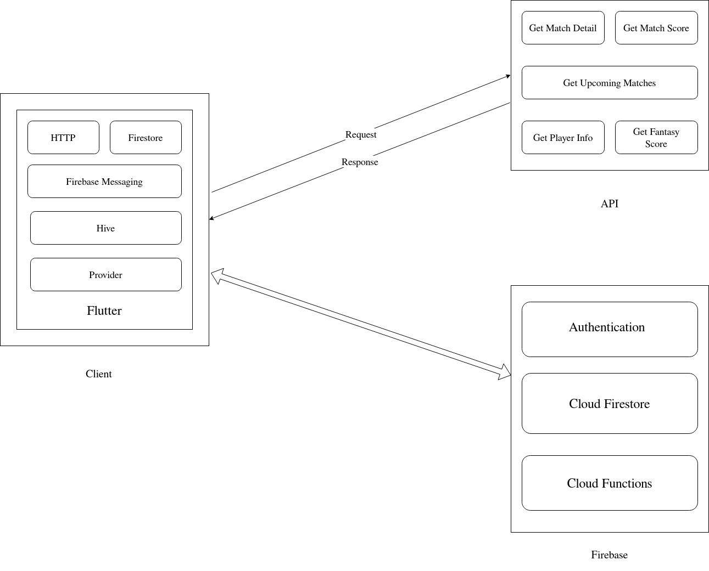

# Sports Private Pool

### Aim of the project:

Fantasy sports were already a big thing in foreign countries, but since India has entered the global market with Dream11 and FantasyIPL, the sector has grown exponentially. At the beginning, when fantasy sports applications entered the market, they targeted and rightly so, the most popular sport in the country, Cricket. The main idea in the app is to select the best possible XI between two teams who will perform the best. The XI who performs the best among the XIs put up by the participants wins. The final score is added up by summing up the points earned by the player during that fixture. These points are fixed already and there is a chance to earn multiple of these points by choosing marquee players for that match. This adds more twist to the already exciting game. But the problem is that the game is exciting for a knowledgeable audience only. For a country as big as India, that number is very high but there's room to bring more people to the application. As stated earlier, the whole country knows the game but it does not imply that everyone knows everything about each and every player in the game; they may be familiar with only stars of the game but enough so that they can select that player to perform well. This is the Tier-II audience, this research aims to target those who like the game enough to play it but are not obsessed with the statistics and previous results.

### Architecture:

### Information Architecture:

### Future Scope:

Game is simple and quick to play but limits users to play one type of contest for a match.. Other types of contests can be added like second innings in Gamezy where users predict the events which will happen between overs. For example, powerplay score for a team, death-overs score. Second innings games are easy and swift, which adhere to our approach towards the fantasy games.

Cricket was chosen as the sport for the game, because of the awareness, popularity and craze of the same in the country. This should not limit this game for only one sport but provides a template to refer to for other sports like football, kabaddi, etc.
